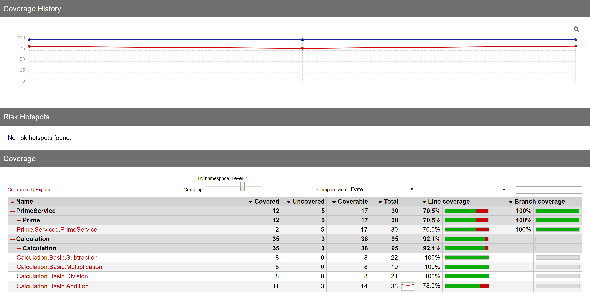
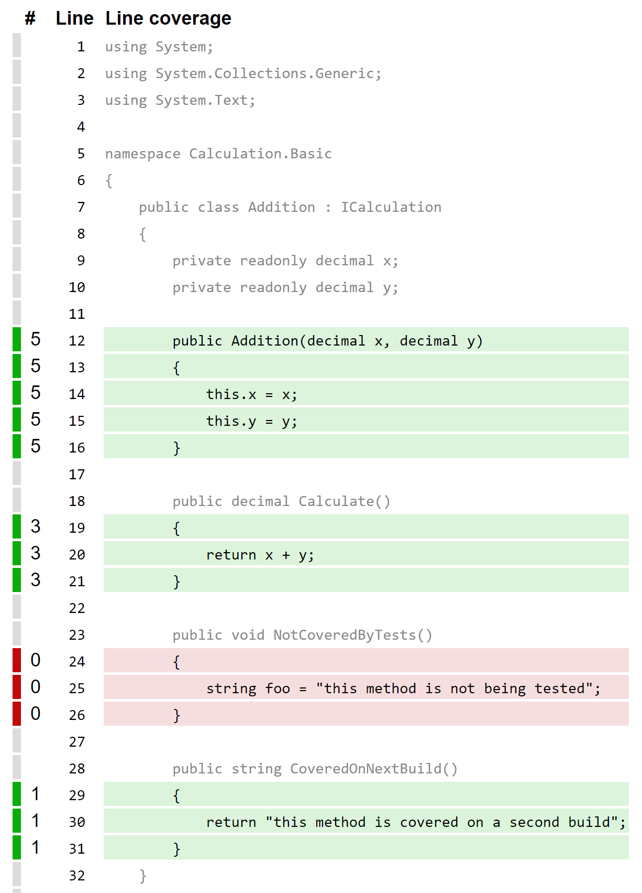
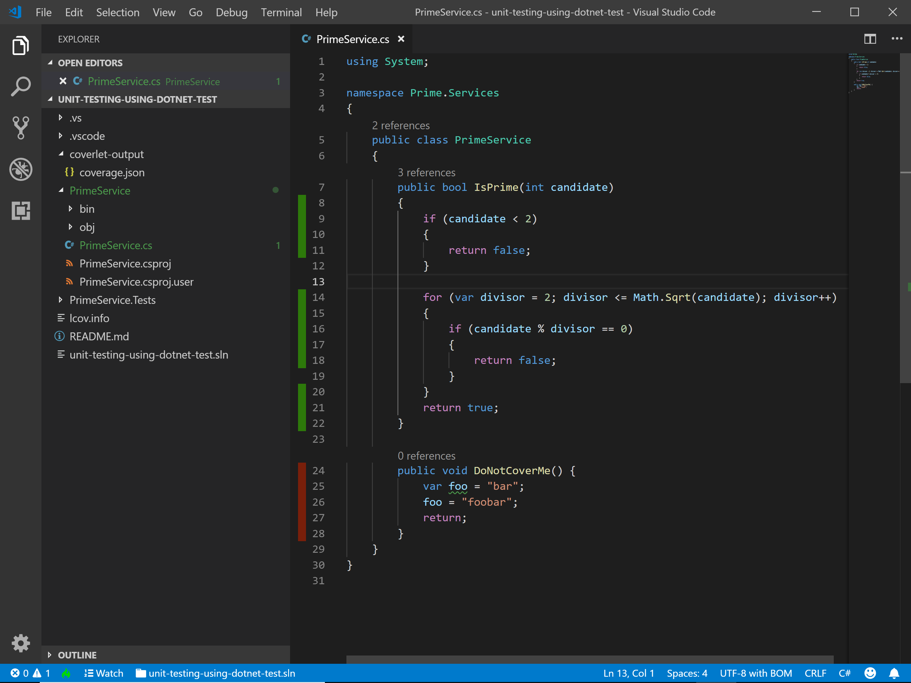

# Timbó status report


## Graphic Report

#### SonarQube, getting it to work

https://www.sonarqube.org/

Using Travis-CI integration

1. Set up Travis-ci.
[C# Project](https://docs.travis-ci.com/user/languages/csharp/) |
[Custom Build](https://docs.travis-ci.com/user/customizing-the-build/)
1. Travis-CI does not support dotnet 2.2 yet. Downgraded to 2.1.
2. Following sonarqube instructions.
[SonarCloud + Travis](https://docs.travis-ci.com/user/sonarcloud/)
3. Generated a Token for the app and included `SONAR_TOKEN` on Travis Settings_
4. Changed some configuration on sonarcloud under `Administration>General Settings`, such as Test files and source files.
5. Add configuration to sonar-project.properties 
[List of sonar parameters](https://docs.sonarqube.org/latest/analysis/analysis-parameters/) |
[sonar-project.properties example](https://github.com/SonarSource/sonar-scanning-examples/blob/master/sonarqube-scanner/sonar-project.properties)
6. 
7. 

#### Report Generator 

Generates a very descriptive `index.htm` under `Calculation.Tests/report-generator-coverage`,
showing line coverage, branch coverage, covered lines, build history.

! Cannot see line coverage of past builds

on this project under `core/getting-started/unit-testing-using-dotnet-test`, run:

```
python3 coverlet.py
cd Calculation.Tests
python3 report-generator.py
```

###### Report Generator Outputs

Branch Coverage 

Line Coverage 

Combined Coverage

    Generated on:	1/3/2019 - 12:29:02 PM
    Parser:	MultiReportParser (2x OpenCoverParser)
    Assemblies:	2
    Classes:	5
    Files:	5
    Covered lines:	47
    Uncovered lines:	8
    Coverable lines:	55
    Total lines:	125
    Line coverage:	85.4%
    Branch coverage:	100%

Includes *build history*:



You can click on a class to see its details:


And it shows line coverage (as shown before on Visual Studio Code).


Next steps are trying Grafana or SonarQube.
#### Report Generator, getting it to work

[Usage instructions](https://danielpalme.github.io/ReportGenerator/usage.html) (generates the cli command)

``` bash
dotnet add package ReportGenerator
```

Make sure to include reportgenerator in your `.csproj`:

    <ItemGroup>
        <DotNetCliToolReference Include="dotnet-reportgenerator-cli" Version="4.0.4" />
      </ItemGroup>

In this case, I used the `Calculation.Tests.csproj` to produce the report for both projects (Calculation and PrimeService).
Apparently ReportGenerator just needs the xml files generated by `coverlet`.

#### Graphic Reports options

Following https://medium.com/agilix/collecting-test-coverage-using-coverlet-and-sonarqube-for-a-net-core-project-ef4a507d4b28

Good Candidates:

0. [Grafana](https://grafana.com/)
1. [SonarQube](https://www.sonarqube.org/) (comes in form of a Docker Image also) (can plugin from github).
    SonarQube seems to be microservices centered because
    it launches a web server and sits behind a HTTP API.
2. [ReportGenerator](https://www.nuget.org/packages/ReportGenerator/4.0.4)

## Integrating with Visual Studio

For graphical display, I'm looking for a integration with visual studio,

Following
https://www.hanselman.com/blog/NETCoreCodeCoverageAsAGlobalToolWithCoverlet.aspx

https://dotnetthoughts.net/code-coverage-in-netcore-with-coverlet/
also seems useful

Tried installing [Coverage Gutters](https://marketplace.visualstudio.com/items?itemName=ryanluker.vscode-coverage-gutters&WT.mc_id=-blog-scottha),
Tried renaming .vsix to .zip, extracting and tinkering with extension.vsixmanifest and back, did not work.

Failed on Visual Studio Professional 2017.
Works on Visual Studio **Code**.



[codecover](https://marketplace.visualstudio.com/items?itemName=bradleymeck.codecover) as a second option to Coverage Gutters perhaps


[dotCover](https://marketplace.visualstudio.com/items?itemName=JetBrains.dotCover) also seems to be a solution that does not use coverlet, but it is paid.


## Coverlet First run


``` bash
mkdir coverlet-output
coverlet.exe PrimeService.Tests/bin/Debug/netcoreapp2.2/PrimeService.Tests.dll --target dotnet --targetargs "test PrimeService.Tests --no-build" -o coverlet-output/
```

Output:

    Test run for C:\Users\rtimbo\source\repos\samples\core\getting-started\unit-testing-using-dotnet-test\PrimeService.Tests\bin\Debug\netcoreapp2.2\PrimeService.Tests.dll(.NETCoreApp,Version=v2.2)
    Microsoft (R) Test Execution Command Line Tool Version 15.9.0
    Copyright (c) Microsoft Corporation.  All rights reserved.

    Starting test execution, please wait...

    Total tests: 11. Passed: 11. Failed: 0. Skipped: 0.
    Test Run Successful.
    Test execution time: 1.5248 Seconds


    Calculating coverage result...
      Generating report 'coverlet-output\coverage.json'
    +--------------------------------------------------+--------+--------+--------+
    | Module                                           | Line   | Branch | Method |
    +--------------------------------------------------+--------+--------+--------+
    | PrimeService                                     | 100%   | 100%   | 100%   |
    +--------------------------------------------------+--------+--------+--------+
    | xunit.runner.reporters.netcoreapp10              | 1.1%   | 0.5%   | 5.1%   |
    +--------------------------------------------------+--------+--------+--------+
    | xunit.runner.utility.netcoreapp10                | 15.7%  | 9.1%   | 21%    |
    +--------------------------------------------------+--------+--------+--------+
    | xunit.runner.visualstudio.dotnetcore.testadapter | 45.6%  | 35.7%  | 47.8%  |
    +--------------------------------------------------+--------+--------+--------+

    +---------+--------+--------+--------+
    |         | Line   | Branch | Method |
    +---------+--------+--------+--------+
    | Total   | 23.8%  | 18%    | 26.6%  |
    +---------+--------+--------+--------+
    | Average | 5.95%  | 4.5%   | 6.65%  |
    +---------+--------+--------+--------+

Output generated on coverlet-output/coverage.json

To exclude xunit, include flag `--exclude "[xunit.runner.*]*"` as follows

```
coverlet.exe PrimeService.Tests/bin/Debug/netcoreapp2.2/PrimeService.Tests.dll --exclude "[xunit.runner.*]*" --target dotnet --targetargs "test PrimeService.Tests --no-build" -o coverlet-output/
```

    Test run for C:\Users\rtimbo\source\repos\samples\core\getting-started\unit-testing-using-dotnet-test\PrimeService.Tests\bin\Debug\netcoreapp2.2\PrimeService.Tests.dll(.NETCoreApp,Version=v2.2)
    Microsoft (R) Test Execution Command Line Tool Version 15.9.0
    Copyright (c) Microsoft Corporation.  All rights reserved.

    Starting test execution, please wait...

    Total tests: 11. Passed: 11. Failed: 0. Skipped: 0.
    Test Run Successful.
    Test execution time: 1.2332 Seconds


    Calculating coverage result...
      Generating report 'coverlet-output\coverage.json'
    +--------------+--------+--------+--------+
    | Module       | Line   | Branch | Method |
    +--------------+--------+--------+--------+
    | PrimeService | 100%   | 100%   | 100%   |
    +--------------+--------+--------+--------+

    +---------+--------+--------+--------+
    |         | Line   | Branch | Method |
    +---------+--------+--------+--------+
    | Total   | 100%   | 100%   | 100%   |
    +---------+--------+--------+--------+
    | Average | 100%   | 100%   | 100%   |
    +---------+--------+--------+--------+


## dotnet test First Run

Under samples/core/getting-started/unit-testing-using-dotnet-test

``` bash
$ dotnet restore
$ dotnet test
```

Output of the test was:

    $ dotnet test
    Build started, please wait...
    Skipping running test for project C:\Users\rtimbo\source\repos\samples\core\getting-started\unit-testing-using-dotnet-test\PrimeService\PrimeService.csproj. To run tests with dotnet test add "<IsTestProject>true<IsTestProject>" property to project file.
    Build completed.

    Test run for C:\Users\rtimbo\source\repos\samples\core\getting-started\unit-testing-using-dotnet-test\PrimeService.Tests\bin\Debug\netcoreapp2.2\PrimeService.Tests.dll(.NETCoreApp,Version=v2.2)
    Microsoft (R) Test Execution Command Line Tool Version 15.9.0
    Copyright (c) Microsoft Corporation.  All rights reserved.

    Starting test execution, please wait...

    Total tests: 11. Passed: 11. Failed: 0. Skipped: 0.
    Test Run Successful.
    Test execution time: 1.5296 Seconds

#### More sample code

[Calculation](https://andrewlock.net/creating-parameterised-tests-in-xunit-with-inlinedata-classdata-and-memberdata/)

# Original README.MD

# Unit testing using dotnet test sample

This sample is part of the [unit testing tutorial](https://docs.microsoft.com/dotnet/core/testing/unit-testing-with-dotnet-test) for creating applications with unit tests included. See that topic for detailed steps on the code for this sample.

## Key features

This sample demonstrates creating a library and writing effective unit tests that validate the features in that library. The example provides a service that indicates whether a number is prime.

## Restore and test

To run the tests, navigate to the *PrimeService.Tests* directory and type the following commands:

```
dotnet restore
dotnet test
```

`dotnet restore` restores the packages of both projects.
`dotnet test` builds both projects and runs all of the configured tests.

[!INCLUDE[DotNet Restore Note](~/includes/dotnet-restore-note.md)]
